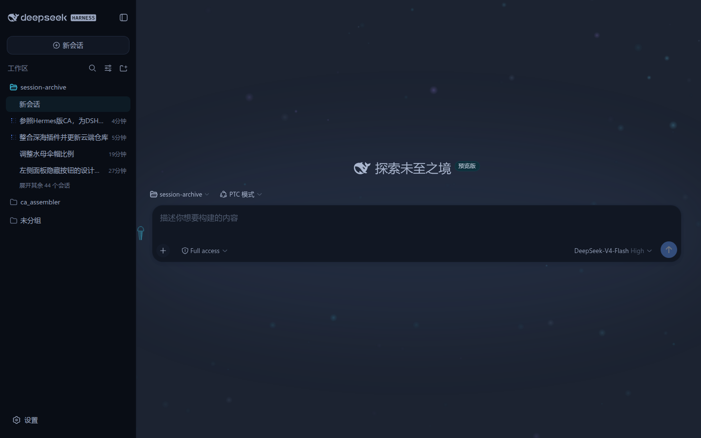
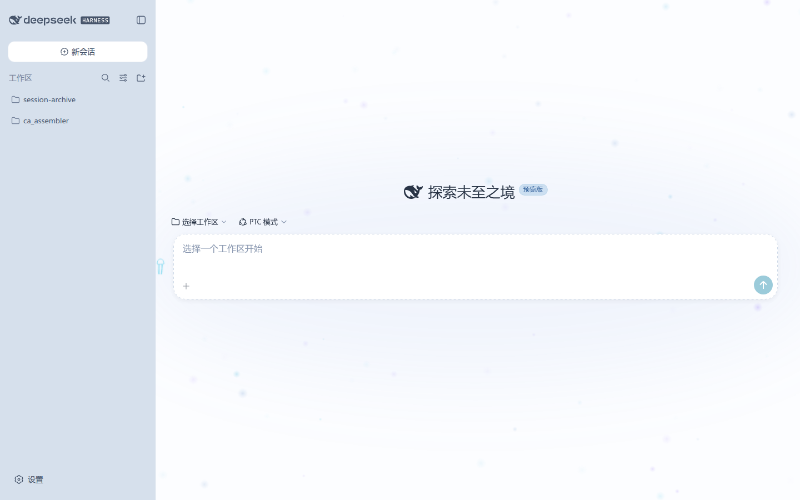

# dsh-krill-theme

> **v1.0.0** · 浮游主题（Krill）· 深海世界 + 浅海世界 双模式主题插件

磷虾（krill）是蓝鲸的餐桌，也是这个插件名字的来源——「浮游主题」让磷虾般的荧光粒子
在对话栏里静静漂游：一个插件覆盖 DSH Web 的**深 / 亮两套外观**，深色模式 = 深海世界，
亮色模式 = 浅海世界。纯客户端 CSS 插件，零依赖、零侵入——不改 dist、不碰组件逻辑，
一处生效全站。

---

## 🖼 效果预览

| 深海 · 深色模式 | 浅海 · 亮色模式 |
|---|---|
|  |  |

*深色 = 深海世界（对话栏 `rgb(28,35,49)`，正文生物荧光软白）；亮色 = 浅海世界（对话栏「阳光水面」全站最白，环境海沫灰蓝退后）。*

对话栏的浮游生物动画背景（APNG 真彩，实拍 30 帧，无限循环）：


> GIF 兜底（256 色）：[assets/plankton-1.0.gif](assets/plankton-1.0.gif)

---

## ✨ 插件特色

### 1. 双模式一体，一个插件管两套外观
- **深色（深海世界）**：以「光的亮度」编码信息重要程度——**越重要越亮**，用户按亮度自然形成注视顺序；环境沉入深海蓝黑，几乎隐形。
- **亮色（浅海世界）**：深海亮度逻辑的反演——以「清澈度」编码，**越重要越清**；对话栏 = 阳光水面全站最白，正文深海军墨，环境海沫灰蓝退后。
- 深/亮两段写在同一个样式表里，选择器互斥（`body[data-ds-dark-theme]` ↔ `body:not([data-ds-dark-theme])`），跟随系统外观自动切换。

### 2. 零侵入的 token 级覆盖
- 所有组件都读取 `--dsw-alias-*` / `--dsw-specific-*` / `--shiki-*` token，插件只需在 `body` 上**重定义约 95+ 个 token 声明** = 一处生效全站（侧栏 / 对话栏 / dock / 浮层 / 菜单 / 设置全部跟随）。
- 不修改 dist、不依赖具体组件类名，升级换代时仅需复查 token 键名 + 3 个组件哈希类名。

### 3. 浮游生物动画背景（对话栏）
- 对话栏（L2 阅读区）带一层极轻量的深海浮游生物动画：canvas 预渲染发光 sprite，**无任何依赖**。
- 洋流驱动：所有粒子同向漂移，流向 / 流速周期性变化，个体仅微小游动扰动——安静、不干扰阅读。
- **实时调参**（无需重启）：水母按钮参数面板 / `window.__DSH_DEEPSEA__.setPlankton()` / CSS 变量三种方式，见「使用与调参」。
- `prefers-reduced-motion` 时自动退化为静态帧（无障碍友好）。

### 4. 深潜（"Deep diving…"）工作态增强
- 生成期间浮游生物进入**深潜**模式：全体粒子 ~40× 流速近乎竖直上冲 + 周期性涌浪（≈3.1s 呼吸节奏）；
- 额外涌出更小更亮的光点（从底部升起，结束即退场）；整体亮度 ×1.15；
- 对话栏背景叠一层**下深上白**的竖向渐变柔光，随上涌节奏温和呼吸——把"正在深潜"的等待感变成体验的一部分。

### 5. 水母参数入口 + 参数面板
- 对话栏右上角一只**水母按钮**（浮动 + 光晕呼吸，触手各自摆动），点击弹出参数面板（青色亮调）；
- 粒子数、透明度、流速、流向、摆动、潮汐脉动、深潜倍率等全部可调，实时生效、无需重启。

### 6. 全站一致的细节
- 侧栏文字降噪（作用域覆盖：只暗化侧栏容器内文字，不碰对话栏）；
- 滚动条、状态色（成功荧光绿 / 警告深海琥珀 / 错误珊瑚红）、发送按钮深海脉动、对话栏 header 渐变衔接；
- 代码高亮双模式适配：深色 = shiki 荧光系（柔雾玫瑰关键字 / 荧光绿字符串 / 荧光青常量 / 荧光紫函数），亮色 = 白底可读系。

---

## 安装

### 社区安装（git）

```bash
# 在 profile 目录（如 ~/.dsh/profiles/web）执行：
dsh plugin --profile web add git+https://github.com/i1j/dsh-krill-theme.git
# Gitee 镜像（国内更快）：
dsh plugin --profile web add git+https://gitee.com/elite1j/dsh-krill-theme.git
```

然后把 `dsh-krill-theme` 加入 profile 的 `dsh.profile.bundles`，重启 `dsh web`。

### profile 手动方式

```jsonc
// <profile>/package.json
{
  "dependencies": {
    "dsh-krill-theme": "link:/path/to/dsh-krill-theme"
  },
  "dsh": {
    "profile": {
      "bundles": [ /* ...已有 bundle... */, "dsh-krill-theme" ]
    }
  }
}
```

然后在 profile 目录执行 `pnpm install` 并重启 `dsh web`。

> 仓库已打上 GitHub `dsh-plugin` 主题标签，可被社区插件搜索
> （`find_dsh_plugin` / dsh-recommend 榜单）发现。

---

## 使用与调参（浮游生物）

对话栏（L2 阅读区）带一层极轻量的深海浮游生物动画（canvas 预渲染发光 sprite，
无依赖；洋流驱动：所有粒子同向漂移、流向/流速周期性变化、个体仅微小游动扰动）。
`prefers-reduced-motion` 时只渲染静态帧。

> 亮色（浅海）下粒子仍为深海荧光色板，不做主题切换（用户裁定，2026-08-15）。

### 参数（默认值）

| 参数 | CSS 变量 | 默认 | 说明 |
|---|---|---|---|
| count | `--dsh-plankton-count` | 90 | 粒子数 |
| opacity | `--dsh-plankton-opacity` | 0.32 | 整体透明度（低，不干扰阅读） |
| speed | `--dsh-plankton-speed` | 0.0007 | 洋流基准流速（视口比例/秒） |
| baseAngle | `--dsh-plankton-angle` | -1.28 | 基准流向（弧度，-π/2=竖直向上，默认斜竖向向上） |
| swing | `--dsh-plankton-swing` | 0.18 | 流向周期摆动幅度（弧度） |
| swingPeriod | `--dsh-plankton-swing-period` | 55 | 流向摆动周期（秒） |
| flowPulse | `--dsh-plankton-flow-pulse` | 0.45 | 流速脉动深度（0..1，潮汐感） |
| flowPulsePeriod | `--dsh-plankton-flow-pulse-period` | 42 | 流速脉动周期（秒） |
| diveCountScale | `--dsh-plankton-dive-count-scale` | 1.6 | 深潜时光点倍率（额外小光点从底部涌出） |
| diveBrightness | `--dsh-plankton-dive-brightness` | 1.15 | 深潜时整体亮度倍率 |
| diveGlow | `--dsh-plankton-dive-glow` | 0.22 | 深潜时面板辉光强度（0 关闭；呼吸幅度温和） |

### 三种调参方式

1. **加载前（window 配置）**：
   ```js
   // 页面加载前（如注入脚本/书签）设置
   window.__DSH_DEEPSEA_PLANKTON__ = { speed: 0.0004, count: 70 }
   ```
2. **实时调参（无需重启）**：
   ```js
   window.__DSH_DEEPSEA__.setPlankton({ speed: 0.001, baseAngle: -1.2 })
   window.__DSH_DEEPSEA__.getPlankton()
   ```
3. **CSS 变量**（自己的样式表里覆盖）：
   ```css
   :root { --dsh-plankton-speed: 0.0004; --dsh-plankton-angle: -1.2; }
   ```

关闭：`window.__DSH_DEEPSEA_PLANKTON__ = false`（加载前设置）。

### 深潜（"Deep diving..." 工作态）增强

生成期间（对话栏出现 `Deep diving...` 状态）浮游生物进入**深潜**模式：

- **加速上涌**：全体粒子以 ~40× 流速近乎竖直上冲，叠加各自相位的周期性涌浪
  （2.0 rad/s ≈ 3.1s 周期），像随深潜节奏呼吸。
- **更多光点**：按 `diveCountScale` 额外涌出更小更亮的光点（从底部边缘下方
  升起，深潜结束即退场）。
- **整体调亮**：粒子亮度乘 `diveBrightness`（默认 1.15），生物荧光更明显。
- **面板辉光脉动**：对话栏背景叠一层预渲染柔光——**下深上白**的竖向渐变（顶部
  近海面的柔白光，向底部渐隐入深海暗色），透明度随上涌节奏（同 2.0 rad/s，
  单相位）在 70%..100% 强度间温和呼吸，总强度由 `diveGlow` 控制（0 关闭）。
  开销：预渲染渐变仅随 resize 重建，每帧只多 1 次 `drawImage`，可忽略。

`prefers-reduced-motion` 时深潜动画同样退化为静态帧（无循环、无辉光脉动）。

---

## 版本

- **v1.0.0（2026-08-15）**：1.0 定版——整合深海（深色）+ 浅海（亮色）双模式为单一插件；
  水母按钮 / 图标 / 参数面板定稿；README 新增实拍配图（深浅双模式截图 + 浮游生物动画——
  APNG 真彩 30 帧无限循环，GIF 256 色兜底）；
  发布 GitHub + Gitee 双镜像仓库。
- **v0.2.2（2026-08-15）**：水母伞帽调大约 1/5（bell ×1.2，锚定伞檐、触角不动）。
- **v0.2.1（2026-08-15）**：水母按钮缩小到约 2/3（40px → 27px，图标 27×44 → 18×29）。
- **v0.2.0（2026-08-15）**：浅海世界亮色色系归并（v1.5），双模式；
  参数面板中性化。
- **v0.1.0（2026-08-14）**：深海世界深色主题 + 浮游生物背景 + 水母参数入口。

---

## 构建

```bash
pnpm install
pnpm typecheck   # tsc --noEmit
pnpm bundle      # tsdown → lib/index.js + lib/client.js
npx tsc -p tsconfig.build.json   # lib/types/*.d.ts
```

## 文件

- `src/client/deepsea.css` —— 主题样式唯一事实源（分段注释，可裁剪；深色段 + 浅海段）
- `src/client/index.ts` —— client 入口（样式注入 + 浮游生物挂载 + 水母按钮）
- `src/client/plankton.ts` —— 浮游生物动画（画布粒子 + 深潜辉光）
- `src/client/params-panel.ts` —— 参数面板（青色亮调）
- `src/client/icons.ts` —— 水母按钮图标（定稿：净修长款）
- `src/index.ts` —— host 入口（空）
- `tsdown.config.ts` —— raw-css 虚拟插件：`.css` 内联为字符串并自注入
- `assets/` —— README 配图与动画（深浅双模式截图 + 浮游生物动画 APNG / GIF）

---

## 设计逻辑

以「光的亮度」编码信息重要程度（深色）或「清澈度」编码（亮色，反演）：

| 层级 | 界面元素 | 深色（深海）视觉编码 | 亮色（浅海）视觉编码 |
|---|---|---|---|
| **L0 环境** | 全局背景 / 侧栏 / dock | 最暗深海蓝黑，近乎隐形 | 海沫灰蓝，退后 |
| **L1 结构** | 面板 / 边框 / 代码块 | 略亮蓝灰，只勾勒轮廓 | 海沫白，只勾勒轮廓 |
| **L2 阅读区** | 对话栏 | 深海军蓝，唯一焦点区 | 阳光水面，全站最白 |
| **L3 正文** | LLM 回答 / 用户问题 | 生物荧光软白，最亮 | 深海军墨，最重 |
| **L4 强调** | 链接 / 按钮 / 状态 / 行内代码 | 荧光色系局部点亮 | 浅海青（白底加深档） |
| **L-1 降噪** | 时间戳 / 元信息 | 暗灰，视线自动跳过 | 浪沫灰，退后 |

---

## 机制

- 插件样式在 bundle 求值时注入 `document.head`（幂等 `style[data-plugin-css="dsh-krill-theme/DeepSeaTheme.css"]` 守卫），晚于 dist token 样式表加载，同特异性下后写覆盖先写。
- 升级换代的复查面：仅 token 键名 + 3 个组件哈希类名（`wSkVaW_root` / `Sxvs8a_body` / `hHd-Xa_root`，来自 `@deepseek-ai/dsh-client-ui-conversation` dist）。

---

## 范围说明

- 本插件只做**主题与颜色**；布局类改动（宽对话栏 1360px、用户气泡对齐、隐藏
  tool-call 节点、隐藏 reasoning、wide.dock 双栏）由 dsh-wide-dock 插件承接。
- 深色 token 层为深色模式专用；亮色 token 层（浅海段）为亮色模式专用——
  亮色模式默认浅海化（取舍：若日后要"原版亮色"需另加开关层）；
  若只要纯深色主题，注释文件末尾的浅海段即可。
- markdown 配色段（行内代码跟随 shiki keyword、引用蓝条、h6 灰、表头底色）双模式生效。

## License

[MIT](LICENSE)
